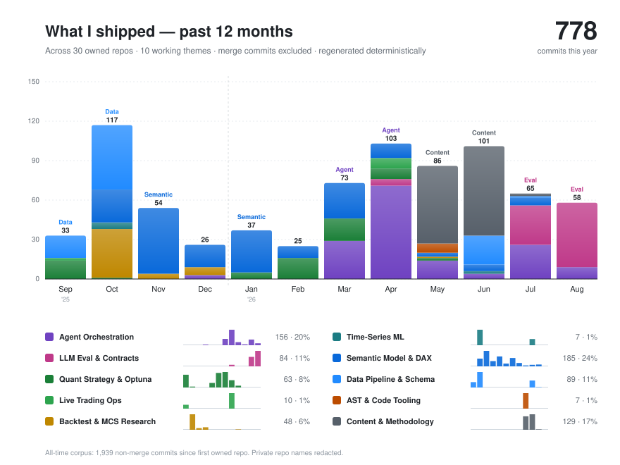

# wlvh

Static snapshot. Hover any segment in the <a href="https://wlvh.github.io/wlvh/">interactive version</a> to see public-repo commit subjects per month · theme bucket. Methodology in <a href="docs/commit-topic-method.md"><code>docs/commit-topic-method.md</code></a>.

I build agentic software systems that turn messy requirements into tested, reviewable, and maintainable code changes.

My work concentrates on two questions: **how do you constrain what an agent is allowed to execute**, and **how do you know whether what it produced is actually acceptable**. Both reduce to the same discipline — make the system state its own capability boundary, keep replayable evidence, and fail explicitly instead of returning a plausible answer.

Current focus: agent evaluation and acceptance, coding-agent workflow infrastructure, NL→DAX contract systems, and quant research infrastructure.

## Selected Work

Two public repositories carry most of the current thesis. They are two halves of one problem: the first constrains the agent that *produces* a change, the second constrains the agent that *accepts* it.

### [coding-workflow](https://github.com/wlvh/coding-workflow) — producer-side control

A bilingual repository workflow for AI-assisted development, centered on the `workflow-docs-sync` Skill.

**The problem.** In a long-lived repository, code, documentation, tests, and PR claims drift apart independently. The dangerous case is not a missing document — it is several documents agreeing with each other about a capability that was never implemented. The next agent reads that agreement as evidence and builds on a false premise.

**What it does**

- Rebuilds project facts from committed code, config, tests, and artifacts rather than trusting existing prose. Documentation claims are assertions to verify, not a source of truth.
- Interrogates existing claims across four coverage dimensions — Architecture, Capability / User Behavior, Testing, Governance. These are coverage requirements, not a fixed four-agent topology; the executor may investigate directly or delegate read-only work.
- When a PR is requested, builds an external clean worktree from the committed HEAD at invocation time, so uncommitted bytes in the original worktree cannot enter either the investigation or the PR. Creates a draft PR only on explicit request — never auto-ready, never auto-merge.
- Separates semantic judgment from mechanical checking: the agent owns findings and minimal rewrites; `sync_docs.py prepare` / `check` own source identity, path safety, UTF-8, markers, final bytes, and Git state.
- Enforces a mechanism-necessity rule: before adding a new marker, alias, or parser, the executor must demonstrate independent state, a real consumer, and a reproducible failure path. The general rule is defined by decision record DEC-006; Case G exercises it through a fresh-context Markdown-marker task. **An evidenced zero-diff is a legitimate success**, not a failed run.

**What it does not claim.** It does not guarantee every semantic detail is correct, and it does not defend against a malicious agent holding the same permissions. It is not a substitute for IAM, CI, or an OS sandbox. On a small, low-risk repository that one person can review by hand, the full workflow is not worth its cost.

### [acceptance-agent](https://github.com/wlvh/acceptance-agent) — acceptor-side information boundary

Spec-visible, implementation-blind verification for multi-agent coding workflows.

**The problem.** Most "reviewer agent" designs let the reviewer read the builder's entire conversation and then agree with it. That reviewer inherits the builder's framing and misses the same contract gap. A second agent is not automatically an independent agent — independence is a property of the information boundary, not of the model name.

**What it does**

- Defines the acceptance packet the verifier may see — user request, functional spec, final diff or artifact, test evidence — and explicitly forbids the rest: builder scratchpad, hidden reasoning, implementation chat, credentials, production data.
- Converges the verdict to three states: `accept` / `reject` / `request_evidence`. The third state is the point — insufficient evidence is neither an acceptance nor a proven implementation failure, and collapsing it into either one is how false accepts happen.
- Requires every blocking finding to carry concrete evidence and the specific fix or evidence needed to clear it, plus a stated residual risk.
- Specifies an ablation over five evidence-packet variants (full packet with and without builder transcript, diff only, test output only, spec only), measured by decision accuracy, false accept rate, false reject rate, and request-evidence rate — with false accepts treated as the primary risk.

**Status, stated plainly.** The mechanism, prompt contract, toy examples, and evaluation design are public. The benchmark has **not** been run, so there are no accuracy numbers here and none should be inferred. Whether hiding the builder transcript actually reduces framing bias is a hypothesis this ablation is designed to test — including the outcome where it turns out not to.

## Private Work and Evidence Status

Some active work is private because it contains research workflows, operational scripts, unpublished infrastructure, or sensitive evaluation data. When implementation details cannot be published safely, I publish sanitized architecture notes, toy examples, and case studies.

| Direction | Evidence status |
| --- | --- |
| Implementation-blind acceptance for reducing structural collusion between builder and reviewer agents | [acceptance-agent](https://github.com/wlvh/acceptance-agent) |
| Evidence-first repository fact reconstruction and isolated draft-PR delivery for coding agents | [coding-workflow](https://github.com/wlvh/coding-workflow) |
| Runtime contract gates for NL→DAX generation and Power BI execution — the model emits only a schema-constrained semantic spec, a coverage stage decides whether that plan is within contract and compiler capability, and a deterministic builder emits the query; an unverifiable time axis is forced to a structured error rather than a plausible trend query | Private implementation; sanitized case study not yet published |
| Bilingual technical publishing infrastructure behind Huaweidata | [huaweidata.com](https://huaweidata.com) |
| Rolling quant validation with multi-freeze ablation and walk-forward evidence | Private implementation |

## Other Public Repositories

| Project | What it demonstrates |
| --- | --- |
| [PySymphony](https://github.com/wlvh/PySymphony) | AST-aware Python code merging with static auditing, dependency ordering, import reinjection, and adversarial tests. |
| [Process_SemanticModel](https://github.com/wlvh/Process_SemanticModel) | Power BI/Fabric semantic model documentation with DAX metadata, relationship checks, and data-health profiling. |
| [RBT](https://github.com/wlvh/RBT) | NumPy/Numba backtesting with switchable strategies and state preservation across regime changes. |
| [RBT_RL](https://github.com/wlvh/RBT_RL) | RL-driven financial decision-chain dataset and agent-selection experiments for RBT workflows. |
| [paper-hub](https://github.com/wlvh/paper-hub) | GitHub Issues + Actions workflow for paper notes, research digests, and AI-assisted recommendations. |

## Writing

[Huaweidata](https://huaweidata.com) is my English-first AI technology magazine with a Chinese mirror. I write long-form notes on agents, software, research, infrastructure, and the institutions forming around AI.

Recent essays:

- [Editor's Desk · May Week 2: When Scaffolding Starts to Cost You](https://huaweidata.com/diary/2026-05-07/)
- [Editor's Desk · Week 1 of May: Paper Collusion, Old Weak Layers, and the Second Chair](https://huaweidata.com/diary/2026-05-05/)

## Contact

- Website: https://huaweidata.com
- Writing archive: https://huaweidata.com/diary/
- Chinese mirror: https://huaweidata.com/zh/diary/
